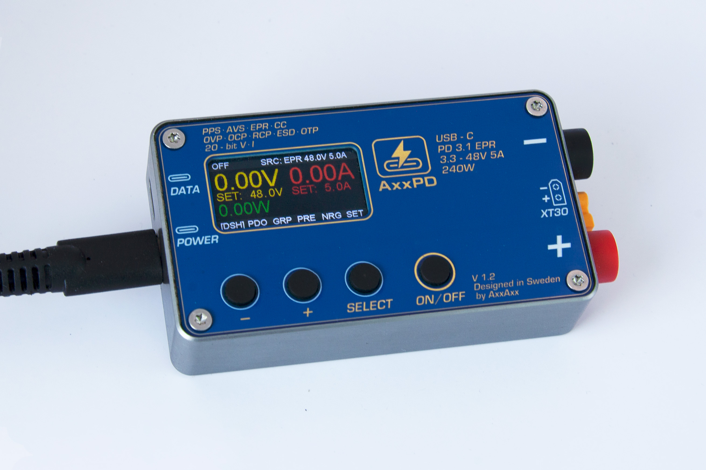
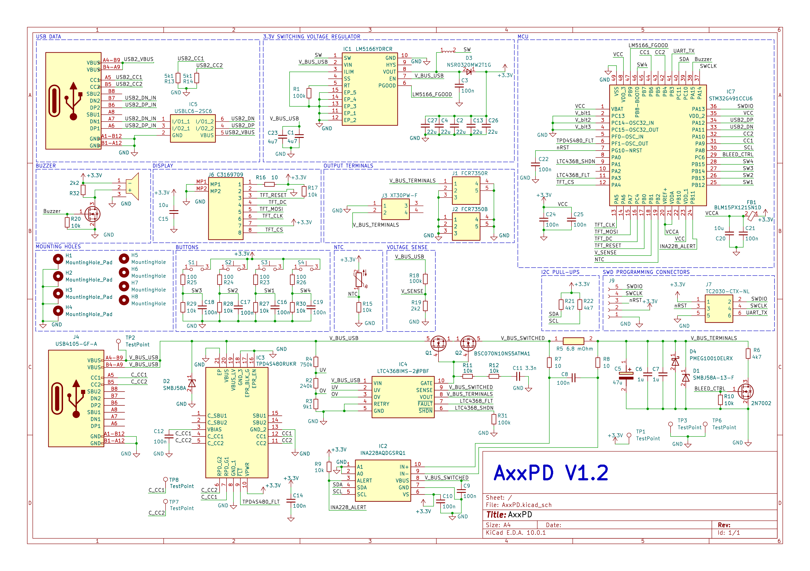

[](https://github.com/AxxAxx/AxxPD/actions/workflows/build.yml)
[](https://www.gnu.org/licenses/gpl-3.0)

Interested in purchasing an AxxPD?
On [Crowd Supply](https://www.crowdsupply.com/) you can back the AxxPD campaign (coming soon).


# AxxPD Overview
AxxPD is a programmable USB-C PD 3.1 EPR sink that lets you use any USB-C PD charger as a bench power supply. It negotiates the best available voltage from the charger -- anywhere from 3.3 V to 48 V and up to 240 W depending on what the charger supports -- and delivers power through XT30 and 4 mm shrouded banana jack outputs.

Designed for lab and field use by embedded developers, ham radio operators, RC/drone hobbyists and electronics enthusiasts. AxxPD features 20-bit precision measurement, multi-layer hardware protection, a 1.47" IPS color display with 6 UI screens, SCPI automation over USB, and a CNC aluminum enclosure with magnetic mount.

The firmware is written for the [STM32G491CCU6](https://www.st.com/en/microcontrollers-microprocessors/stm32g491ce.html) in C/C++17 and is open source under the GPL-3.0 license.



# Getting Started

## What You Need

- **USB-C PD charger** -- any charger that supports USB Power Delivery (laptop chargers, GaN chargers, etc.). Higher power chargers (65 W+) unlock more voltage options.
- **USB-C cable** -- to connect the charger to AxxPD.
- **USB data cable** (optional) -- to monitor and control AxxPD from your PC via the WebSerial dashboard or serial terminal.

## First Power-On

1. Plug your USB-C PD charger into AxxPD. The splash screen appears briefly.
2. The **boot PDO selector** shows all voltages your charger supports (5 V, 9 V, 15 V, 20 V, etc.).
3. Use **UP/DOWN** to highlight a voltage, then press **SELECT** to confirm. Or wait 10 seconds for auto-select.
4. The **Dashboard** screen appears with live voltage, current and power readouts.

## Basic Operation

AxxPD has 4 buttons:
- **UP / DOWN** -- adjust voltage or navigate menus (hold to repeat)
- **SELECT** -- confirm selection, cycle screens, enter edit mode
- **POWER** -- short press: output ON/OFF, long press: output OFF

The output starts **OFF** for safety. Press POWER to enable it. The status bar turns green when output is active.

## Connecting to Your PC

1. Connect a USB-C data cable between AxxPD and your PC (same port as power, if your cable supports data).
2. Open [the dashboard](./Tools/AxxPD_Dashboard.html) in **Chrome or Edge 89+** (Firefox/Safari not supported -- WebSerial API required).
3. Click **Connect** and select AxxPD from the device list.

Alternatively, use any serial terminal at 115200 baud. Type `help` for a command list.

## Safety Notes

- **Always verify the voltage** before connecting your load.
- **Output is OFF by default** -- press POWER to enable.
- AxxPD monitors temperature and will warn at 60 C, shut down at 85 C.
- Maximum output depends entirely on your charger's capabilities.
- **Fault screens require SELECT to clear** -- the POWER button is blocked during active faults.
- **Boot auto-select** defaults to a safe voltage (≤20 V) if the user doesn't interact within 10 seconds.

# Table of Contents
- [AxxPD Overview](#axxpd-overview)
- [Getting Started](#getting-started)
- [Features](#features)
- [Specifications](#specifications)
- [Schematic](#schematic)
- [Protection Architecture](#protection-architecture)
- [Power Flow](#power-flow)
- [Boot Sequence](#boot-sequence)
- [User Interface](#user-interface)
- [WebSerial Dashboard](#webserial-dashboard)
- [Python Library](#python-library)
- [SCPI Command Reference](#scpi-command-reference)
- [Firmware Update](#firmware-update)
- [Building the Firmware](#building-the-firmware)
- [Settings](#settings)
- [Repository Structure](#repository-structure)
- [Open Source and Licensing](#open-source-and-licensing)
- [Third-Party Components](#third-party-components)
- [Disclaimer](#disclaimer)

# Features
- USB-C PD 3.1 EPR sink supporting Fixed, PPS and AVS voltage modes. The available voltages and power depend entirely on the connected USB-C charger's capabilities.
- 20-bit precision voltage, current and power monitoring via INA228 (6.8 mOhm shunt, 0.05% gain error).
- Multi-layer hardware protection with sub-microsecond response times. See [Protection Architecture](#protection-architecture).
- 1.47" 320x172 IPS TFT color display (ST7789V, SPI) with 4-button navigation and 6 UI screens: Dashboard, PDOs, Graph, Presets, Energy and Settings.
- USB CDC serial interface for SCPI commands and data logging at 20 Hz.
- Browser-based WebSerial dashboard with live readout, chart, and CSV recording (zero install).
- Python scripting library (`pip install axxpd`) for automated test rigs and CI integration.
- USB DFU firmware updates via `dfu` CLI command or Settings menu.
- Programmable voltage presets stored in flash (up to 5 slots).
- Programmable voltage sequencing with configurable step times.
- Energy tracking with INA228 hardware Wh/Ah accumulators.
- Constant current mode via PPS operating current control.
- CNC aluminum enclosure with magnetic mount (93 x 49 x 20 mm with connectors).
- NTC thermal monitoring with staged protection (warn at 60 deg C, shutdown at 85 deg C).
- Output bleed/discharge circuit for safe capacitor discharge when output is disabled.
- Dual output: XT30 (female) and 4 mm shrouded banana jacks in parallel.

# Specifications

| Parameter | Value |
|-----------|-------|
| Input | USB-C PD 3.1 EPR (3.3-48 V, up to 5 A) |
| PD Modes | Fixed PDO, PPS (3.3-21 V), AVS (15-48 V) |
| Max Power | 240 W (charger dependent) |
| Voltage Measurement | 20-bit, 0-85 V range, ~1 mV resolution |
| Current Measurement | 20-bit, 6.8 mOhm shunt, ~0.1 mA resolution |
| OVP | Hardware: LTC4368 (53 V) + COMP1 backup |
| OCP | Hardware: LTC4368 (7.4 A) + INA228 ALERT backup |
| Display | 1.47" 320x172 IPS TFT (ST7789V, SPI) |
| Outputs | XT30 female + 4 mm shrouded banana jacks |
| Interface | USB CDC serial (SCPI + CLI) |
| MCU | STM32G491CCU6 (Cortex-M4F, 128 MHz) |
| Flash Usage | ~75% of 256 KB |
| Enclosure | CNC aluminum, magnetic mount |
| Dimensions | 93 x 49 x 20 mm (with connectors) |

# Schematic
The schematic for AxxPD is shown below. The full-resolution vector version is available as [SVG](./Documentation/AxxPD_Schematic.svg). The MCU is a [STM32G491CCU6](https://www.st.com/en/microcontrollers-microprocessors/stm32g491ce.html) (Cortex-M4F, 256 KB flash, 112 KB SRAM).



# Protection Architecture
AxxPD implements multiple independent protection layers, ordered by response time (fastest first). The hardware protection operates autonomously without firmware involvement.

| Layer | Component | Response Time | Function |
|-------|-----------|---------------|----------|
| 1 | SMBJ58A TVS | < 1 ns | Passive VBUS voltage clamp at ~64 V |
| 2 | TPD4S480 | ~100 ns | CC/SBU short-to-VBUS disconnect protection (63 V withstand, 48 V EPR rated) |
| 3 | LTC4368 OVP | ~6 us | Primary OVP via OV pin divider (53 V trip) |
| 4 | COMP1 + TIM15 BKIN | ~275 us | Backup OVP -- hardware comparator forces SHDN LOW, no CPU involvement |
| 5 | LTC4368 OCP | ~8 us | Primary OCP -- 50 mV across 6.8 mOhm sense resistor (7.4 A forward trip) |
| 6 | INA228 ALERT EXTI | ~150 us | Backup OCP -- configurable current threshold, EXTI ISR disables output |
| 7 | Firmware polling | ~1-10 ms | Thermal limits, energy limits, timer shutoff |
| 8 | R_GPD pull-down | Passive | Fail-safe -- MOSFET gates default OFF if LTC4368 unpowered |

The LTC4368 hot-swap controller drives back-to-back BSC070N10NS5 MOSFETs with a charge pump gate drive (+13.1 V). The COMP1 + DAC3 backup OVP threshold is software-adjustable per negotiated voltage. A 100K pull-down on the SHDN pin (PA1/TIM15_CH1N) ensures the output remains off during MCU boot and reset.

Additional firmware protection features:
- **OCP retry with soft-start** -- configurable 3-retry policy (default) handles hot-plug inrush current. Output caps stay charged during retry for cleaner recovery via LTC4368 gate ramp.
- **Charger disconnect detection** -- output auto-disabled when PD contract is lost.
- **Output toggle cooldown** -- 1.5 s minimum between enable events to prevent MOSFET thermal stress.
- **Fault buzzer override** -- critical fault tones always play even if buzzer is disabled in settings.
- **Post-suppression fault poll** -- after the inrush suppression window expires, firmware polls LTC4368_FLT, INA228_ALERT, and COMP1 OVP to catch edge-triggered faults missed during suppression.
- **OCP bounds** -- CLI `protect ocp` enforces 0.1 A minimum and 7 A maximum.

# Power Flow
```
USB-C (3.3-48 V VBUS)
    |
    +--> SMBJ58A TVS (passive clamp)
    |
    +--> LTC4368-2 --> Q1 --> Q2 --> R_SENSE (6.8 mOhm)
    |       OVP: 53 V, UVP: 2.0 V, OCP: 7.4 A, RCP: -0.44 A
    |
    +--> INA228 (ALERT --> PB11 EXTI, measures load current)
    |
    +--> Output flyback Schottky + Output TVS + switched bleed
    |
    +--> XT30 + 4mm Banana Jacks (parallel)

USB-C VBUS --> LM5166 sync buck (3-65 V) --> 3.3 V rail
```

# Boot Sequence
AxxPD is entirely bus-powered from VBUS with no battery. A two-phase cold boot is used to handle the charger's pre-contract current limit:

**Phase 1 -- 16 MHz HSI (low current, PD negotiation):**
1. Dead-battery pull-downs on PA9/PA10 present Rd to source, source provides 5 V
2. HAL init at 16 MHz HSI (minimal current draw)
3. UCPD + DMA init, PD stack negotiates 5 V contract
4. Stabilization loop -- tick PD for up to 1 s, break early on contract

**Phase 2 -- 128 MHz PLL (full speed):**
5. Switch to 128 MHz PLL (APB1 prescaler /8 keeps UCPD timing correct)
6. All peripheral init (ADC, I2C, SPI, USB, COMP, TIM, DAC)
7. Splash screen, cable emulation, boot PDO selector
8. EPR entry attempted at 1 s mark, auto-select after 10 s
9. Watchdog start (5 s), main loop at 100 Hz INA228 / 30 Hz UI

# User Interface
AxxPD has a 1.47" 320x172 IPS TFT display (ST7789V, SPI at 32 MHz) and 4 buttons:
- **UP** -- increase value / scroll up (hold-to-repeat)
- **DOWN** -- decrease value / scroll down (hold-to-repeat)
- **SELECT** -- confirm / cycle screens
- **POWER** -- short press: output ON/OFF, long press: output OFF

**Screen 1 -- Dashboard:**
Large V (yellow) / I (red) / W (green) readout. SET voltage and current targets. CC/CV mode indicator. Live UP/DOWN adjustment with blinking cursor in edit mode.

**Screen 2 -- PDOs:**
Scrollable list of source capability PDOs including EPR AVS entries. Cable e-marker info.

**Screen 3 -- Graph:**
Rolling V/I plot (10 s window). Column-based rendering for fast SPI updates. 15 Hz throttle.

**Screen 4 -- Presets:**
5 named user slots. Select and activate with one button press. Stored in flash.

**Screen 5 -- Energy:**
Wh / Ah / elapsed time. Long-press SELECT to reset accumulators.

**Screen 6 -- Settings:**
6 groups with scrollable menus: Mode, Sound, Protection, Tools, Calibration, System.

# WebSerial Dashboard
A browser-based dashboard is included at [`Tools/AxxPD_Dashboard.html`](./Tools/AxxPD_Dashboard.html). Open it in Chrome or Edge 89+ and connect to AxxPD via USB-C. No drivers or installs required. The dashboard provides:
- Live voltage, current and power readout
- Rolling V/I chart with hover tooltip
- PDO selector dropdown
- Output ON/OFF and lock controls
- CSV recording -- click Record, run your test, click Stop, then Download CSV (20 Hz telemetry with timestamps)
- Interactive SCPI terminal with command history

## Python Library
A Python library is available for scripted control and automation:
```
pip install axxpd
```
```python
from axxpd import AxxPD

with AxxPD() as pd:              # auto-detects the AxxPD serial port
    pd.set_voltage(12.0)
    pd.output_on()
    m = pd.measure()
    print(f"{m['voltage']:.3f} V, {m['current']:.3f} A")

    for sample in pd.stream(duration=10):
        print(sample)            # 20 Hz telemetry dicts

    pd.output_off()
```
The library wraps every SCPI command as a Python method and supports streaming telemetry via generator or callback. Source: [`Tools/axxpd/`](./Tools/axxpd/)

# SCPI Command Reference
AxxPD has a comprehensive command interface over USB CDC serial (115200 baud) supporting both interactive shortcut commands and full SCPI. See the **[complete command reference](./Documentation/AxxPD_Command_Reference.md)** for all commands, SCPI subsystems, scripting examples and the data stream format.

Key commands:

| Command | Description |
|---------|-------------|
| `list` | List available source PDOs |
| `set <V> [A]` | Set voltage (auto-selects best PDO type) |
| `setpdo <N>` | Select PDO by index |
| `setpps <V> [A]` | Set PPS voltage and optional current limit |
| `setavs <V>` | Set AVS voltage (EPR) |
| `on` / `off` | Enable / disable output |
| `epr` / `spr` | Enter / leave EPR mode |
| `meas` | Read voltage, current, power, temperature |
| `stream on/off` | Toggle 20 Hz CSV telemetry |
| `selftest` | Walk all PDOs and report pass/fail |
| `protect ocp <A>` | Set OCP threshold |
| `protect ovp <V>` | Set OVP threshold |
| `protect status?` | Query protection status |
| `protect clear` | Clear fault latch |
| `seq add <V> <t_ms>` | Add voltage sequence step |
| `seq run` / `seq stop` | Run / stop voltage sequence |
| `reboot` | Reboot device |
| `dfu` | Enter DFU bootloader |

See `Firmware/axxpd_firmware/cli.cpp` for the complete command table.

# Firmware Update
The firmware can be updated via SWD programmer or USB DFU.

## SWD Programmer
1. Download the latest `AxxPD.bin` from [Releases](https://github.com/AxxAxx/AxxPD/releases)
2. Connect an ST-Link programmer to the SWD pads (GND, 3.3V, SWCLK, SWDIO)
3. Flash using [STM32CubeProgrammer](https://www.st.com/en/development-tools/stm32cubeprog.html) or the command line:
```
STM32_Programmer_CLI -c port=SWD freq=4000 -w AxxPD.bin 0x08000000 -v -rst
```

## USB DFU
1. Enter DFU mode by sending the `dfu` command over USB serial, or via Settings > System > DFU
2. Use STM32CubeProgrammer, select USB connection, and flash the `.bin` file
3. Power cycle after flashing

# Building the Firmware
The firmware targets the STM32G491CCU6 and is built with STM32CubeIDE or arm-none-eabi-gcc.

**Option 1 -- STM32CubeIDE:**
1. Import the `Firmware/` directory as an existing STM32CubeIDE project
2. Build with the default Debug or Release configuration

**Option 2 -- Command line:**
```
cd Firmware
make -j$(nproc)
```
Requires `arm-none-eabi-gcc` on your PATH. The firmware compiles to approximately 75% of the 256 KB flash at `-Os` optimization.

# Settings
Settings are accessed via the Settings screen (Screen 6) using the 4-button navigation. Settings are stored in the last 2 KB page of internal flash with magic byte and CRC validation.

| Group | Setting | Description | Default |
|-------|---------|-------------|---------|
| Mode | PD Mode | AUTO / FIX / PPS / AVS | AUTO |
| Mode | Cable Emu | Cable e-marker emulation for EPR | ON |
| Sound | Buzzer | Enable/disable buzzer | ON |
| Sound | Alert Tones | Alert sound on fault | ON |
| Protection | OCP Threshold | Over-current protection limit | 5.5 A |
| Protection | OVP Threshold | Over-voltage protection (COMP1+DAC3 backup) | Auto |
| Protection | OPP Threshold | Over-power protection limit | OFF |
| Protection | Timer Shutoff | Auto-disable output after countdown | OFF |
| Protection | Ah Limit | Disable output at charge limit | OFF |
| Protection | Wh Limit | Disable output at energy limit | OFF |
| Protection | Retry Policy | Latch / 1-retry / 3-retry on fault | 3-retry |
| Tools | Selftest | Walk all source PDOs, report pass/fail | -- |
| Tools | Stream | Toggle USB CDC data streaming | OFF |
| Calibration | V Offset | Voltage measurement offset | 0 |
| Calibration | I Offset | Current measurement offset | 0 |
| Calibration | Shunt Value | Current sense resistor value | 6.8 mOhm |
| System | Brightness | Display backlight level | 100% |
| System | Serial Terminal | Enable USB CDC serial interface | ON |
| System | Reboot | Reboot device | -- |
| System | DFU | Enter USB DFU bootloader | -- |

# Repository Structure
```
AxxPD/
  Firmware/              STM32G491 firmware (C/C++17, STM32CubeIDE project)
    axxpd_firmware/      AxxPD application code (GPL-3.0)
    Core/                STM32 HAL initialization and peripherals
    Drivers/             STM32 HAL, CMSIS, LCD driver, uGUI
    pdsink/              USB PD 3.2 protocol stack (MIT)
    etl/                 Embedded Template Library (MIT)
    Middlewares/         STM32 USB Device Library
    USB_Device/          USB CDC application layer
  Tools/                 WebSerial dashboard, Python library, test scripts
    axxpd/               Python SCPI library (pip install axxpd)
  Documentation/         Schematic, command reference, product photos
```

# Open Source and Licensing

## Firmware (Open Source)
The AxxPD firmware is fully open source under the [GNU General Public License v3.0](LICENSE). You are free to study, modify and redistribute the firmware source code. The complete build toolchain (Makefile, linker scripts, STM32CubeIDE project files) is included so you can compile and flash the firmware yourself.

## Hardware (Proprietary)
The PCB layout, component placement and enclosure CAD files are proprietary and not included in this repository. The [schematic](#schematic) is published for reference but the production design files are not open source.

If you are interested in the hardware design, AxxPD is available as an assembled and tested unit through [Crowd Supply](https://www.crowdsupply.com/).

## Trademark
"AxxPD" is a trademark of Axel Johansson. Derivative works may describe themselves as "based on AxxPD" or "derived from AxxPD firmware" for attribution, but must not use "AxxPD" as a product name. See [NOTICE](NOTICE) for full details.

# Third-Party Components
AxxPD firmware includes the following third-party open-source components:

| Component | License | Description |
|-----------|---------|-------------|
| [pdsink](https://github.com/pdsink/pdsink) | MIT | USB PD 3.2 protocol stack |
| [ETL](https://github.com/ETLCPP/etl) | MIT | Embedded Template Library |
| [uGUI](https://github.com/AxxAxx/uGUI) | MIT | Micro Graphics Library |
| STM32 HAL / CMSIS / USB | BSD-3-Clause | STMicroelectronics device libraries |

# Disclaimer
AxxPD is provided as-is with no warranty or guarantees on functionality or reliability. The author accepts no liability for any harm or loss resulting from its use. AxxPD handles voltages up to 48 V and currents up to 5 A -- always verify your setup and connections before enabling the output.

## Stargazers over time
[](https://starchart.cc/AxxAxx/AxxPD)
