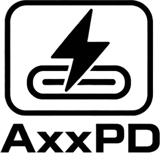
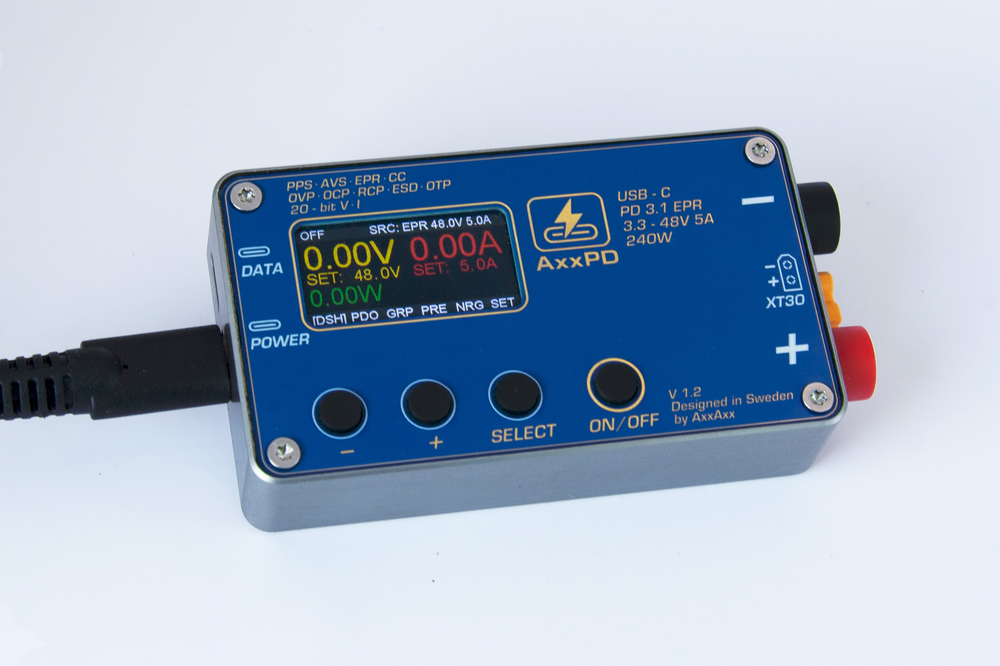

[](https://github.com/AxxAxx/AxxPD/actions/workflows/build.yml)
[](https://www.gnu.org/licenses/gpl-3.0)



# AxxPD

AxxPD turns any USB-C PD charger into a programmable bench power supply. It negotiates the best voltage the charger offers — anywhere from 3.3 V to 48 V and up to 240 W — and delivers it through XT30 and 4 mm shrouded banana outputs, with 20-bit measurement, multi-layer hardware protection, a 1.47" color display, and SCPI automation over USB.

Built for embedded developers, ham radio operators, RC/drone hobbyists and electronics enthusiasts. The firmware runs on an [STM32G491CCU6](https://www.st.com/en/microcontrollers-microprocessors/stm32g491ce.html) and is open source under the GPL-3.0 license.

An assembled unit is available through [Crowd Supply](https://www.crowdsupply.com/) (campaign coming soon).



## Features

- USB-C PD 3.1 EPR sink — Fixed, PPS and AVS modes. Available voltages and power depend on the connected charger.
- 20-bit voltage/current/power monitoring (INA228, 6.8 mΩ shunt).
- Multi-layer hardware protection with sub-microsecond response — see [Protection](#protection).
- 1.47" 320×172 IPS display (ST7789V) with 4-button navigation and six screens.
- USB-CDC command interface (SCPI + shortcuts) and 20 Hz CSV telemetry.
- Browser-based WebSerial dashboard — live readout, chart and CSV recording, zero install.
- Programmable presets (5 slots) and voltage sequencing, stored in flash.
- Energy tracking (INA228 Wh/Ah accumulators) and PPS-based constant-current mode.
- CNC aluminium enclosure with magnetic mount; dual XT30 + 4 mm banana outputs.

## Specifications

| Parameter | Value |
|-----------|-------|
| Input | USB-C PD 3.1 EPR (3.3–48 V, up to 5 A) |
| PD modes | Fixed PDO, PPS (3.3–21 V), AVS (15–48 V) |
| Max power | 240 W (charger dependent) |
| Measurement | 20-bit, ~1 mV / ~0.1 mA resolution (INA228, 6.8 mΩ) |
| OVP | LTC4368 (~53 V) + COMP1/DAC backup |
| OCP | LTC4368 (~7.4 A) + INA228 ALERT backup |
| Display | 1.47" 320×172 IPS TFT (ST7789V, SPI) |
| Outputs | XT30 female + 4 mm shrouded banana (parallel) |
| MCU | STM32G491CCU6 (Cortex-M4F, 128 MHz, 256 KB flash) |
| Enclosure | CNC aluminium, magnetic mount, 93 × 49 × 20 mm |

## Getting Started

Plug a USB-C PD charger into AxxPD. After the splash screen, the **boot PDO selector** lists the voltages your charger supports — use **UP/DOWN** to pick one and **SELECT** to confirm (or wait 10 s for a safe auto-select of ≤ 20 V). The **Dashboard** then shows live V/I/W.

The four buttons are **UP/DOWN** (adjust / navigate, hold to repeat), **SELECT** (confirm / cycle screens / edit) and **POWER** (short: output on/off; long: off). The output starts **OFF**; the status bar turns green when it is live.

To control it from a PC, connect a USB-C data cable and open [the dashboard](./Tools/AxxPD_Dashboard.html) in Chrome or Edge 89+ (WebSerial required), or use any serial terminal at 115200 baud and type `help`.

**Safety:** verify the voltage before connecting a load; output is OFF by default; the device warns at 60 °C and shuts down at 85 °C; a fault screen must be cleared with SELECT (POWER is blocked during a fault). Maximum output is limited by your charger.

## Protection

Independent protection layers, fastest first. The hardware layers act autonomously, without firmware.

| # | Component | Response | Function |
|---|-----------|----------|----------|
| 1 | SMBJ58A TVS | < 1 ns | Passive VBUS clamp (~64 V) |
| 2 | TPD4S480 | ~100 ns | CC/SBU short-to-VBUS disconnect (48 V EPR rated) |
| 3 | LTC4368 OVP | ~6 µs | Primary over-voltage (~53 V trip) |
| 4 | LTC4368 OCP | ~8 µs | Primary over-current (50 mV / 6.8 mΩ ≈ 7.4 A) |
| 5 | INA228 ALERT | ~150 µs | Backup OCP (configurable), EXTI disables output |
| 6 | COMP1 + TIM15 | ~275 µs | Backup OVP — comparator forces SHDN low, no CPU |
| 7 | Firmware poll | ~1–10 ms | Thermal, energy and timer limits |
| 8 | SHDN pull-down | passive | Fail-safe — output defaults OFF if MCU/LTC4368 unpowered |

The LTC4368 hot-swap controller drives back-to-back MOSFETs; the COMP1/DAC backup OVP threshold tracks the negotiated voltage. Firmware adds OCP soft-start retry (default 3×) for hot-plug inrush, charger-disconnect shutoff, and a 1.5 s output-toggle cooldown.

## User Interface

Six screens, cycled with SELECT:

1. **Dashboard** — large V/I/W readout; set voltage/current with live edit and CC/CV indication.
2. **PDOs** — scrollable source capabilities incl. EPR AVS, plus cable e-marker info.
3. **Graph** — rolling V/I plot, one sample per pixel for smooth scrolling; selectable 5/10/30/60 s window.
4. **Presets** — five named slots, stored in flash.
5. **Energy** — session runtime, Wh/Ah, plus average and peak I/P (long-press SELECT resets).
6. **Settings** — grouped menus: Mode, Display, Sound, Protection, Tools, Calibration, System.

Defaults: output OFF at boot, OCP 5.5 A, OVP 55 V, 3-retry, 10 s graph window. Settings persist in the last 2 KB flash page (magic + CRC).

## Command Interface

AxxPD exposes both interactive shortcuts and full SCPI over USB-CDC (115200 baud). See the **[complete command reference](./Documentation/AxxPD_Command_Reference.md)** for every command, the SCPI subsystems, scripting examples and the telemetry format.

| Command | Description |
|---------|-------------|
| `list` | List available source PDOs |
| `set <V> [A]` | Set voltage (auto-selects the best PDO type) |
| `setpps <V> [A]` / `setavs <V>` | PPS / AVS (EPR) request |
| `on` / `off` | Enable / disable output |
| `epr` / `spr` | Enter / leave EPR mode |
| `meas` | Voltage, current, temperatures + I²C diagnostics |
| `stream on [hz]` / `off` | CSV telemetry (default 20 Hz, up to 1 kHz) |
| `protect ocp\|ovp <val>` / `status` / `clear` | Protection control |
| `seq add <V> <ms>` / `run` / `stop` | Voltage sequencing |
| `selftest` · `reboot` · `dfu` | Self-test · reboot · enter DFU |

## Testing

Two host-side tools in `Tools/` (Python + pyserial) drive the device over USB-CDC and need **no load connected**:

```bash
python Tools/charger_test.py         # verify PD negotiation across all levels
python Tools/axxpd_selftest_full.py  # full standalone feature test (colour report, CI-friendly)
```

`axxpd_selftest_full.py` writes a timestamped pass/fail report and exits non-zero on failure.

## Firmware Update

The application runs directly from flash at `0x08000000` (no custom bootloader).

- **USB DFU** — enter the STM32 ROM bootloader (hold the boot button while applying power, or send `dfu` over serial), then flash the `.bin` at `0x08000000` with [STM32CubeProgrammer](https://www.st.com/en/development-tools/stm32cubeprog.html) or `dfu-util`. A USB-A source keeps VBUS up in ROM DFU.
- **SWD** — connect an ST-Link to the SWD pads and flash `AxxPD.bin`:
  ```
  STM32_Programmer_CLI -c port=SWD mode=UR reset=HWrst -w AxxPD.bin 0x08000000 -v -rst
  ```

## Building

Import `Firmware/` into STM32CubeIDE, or build from the command line with `arm-none-eabi-gcc` on your PATH:

```bash
cd Firmware && make -j
```

Output is `build/AxxPD.elf`; `-Os`, ~77 % of the 256 KB flash.

## Repository Structure

```
Firmware/         STM32G491 firmware (C/C++17, CubeIDE project)
  axxpd_firmware/ Application code (GPL-3.0)
  Core/ Drivers/  HAL, CMSIS, LCD driver, uGUI
  pdsink/ etl/    USB-PD stack + Embedded Template Library (MIT)
Tools/            WebSerial dashboard, host-side test scripts
Documentation/    Schematic (SVG), command reference, photos
```

The schematic is published as [SVG](./Documentation/AxxPD_Schematic.svg) for reference.

## Licensing

The **firmware is open source** under the [GPL-3.0](LICENSE), with the full toolchain (Makefile, linker script, CubeIDE project) included so you can build and flash it yourself. The **PCB and enclosure design files are proprietary** and not part of this repository; the schematic is published for reference only.

"AxxPD" is a trademark of Axel Johansson. Derivatives may state they are "based on AxxPD" but must not use "AxxPD" as a product name — see [NOTICE](NOTICE).

### Third-party components

| Component | License |
|-----------|---------|
| [pdsink](https://github.com/pdsink/pdsink) — USB-PD stack | MIT |
| [ETL](https://github.com/ETLCPP/etl) — Embedded Template Library | MIT |
| [uGUI](https://github.com/AxxAxx/uGUI) — graphics library | Custom permissive |
| STM32 HAL / USB Device Library | BSD-3-Clause |
| CMSIS | Apache-2.0 |

## Disclaimer

AxxPD is provided as-is, with no warranty. It handles up to 48 V / 5 A — always verify your setup before enabling the output. The author accepts no liability for any harm or loss resulting from its use.

[](https://starchart.cc/AxxAxx/AxxPD)
